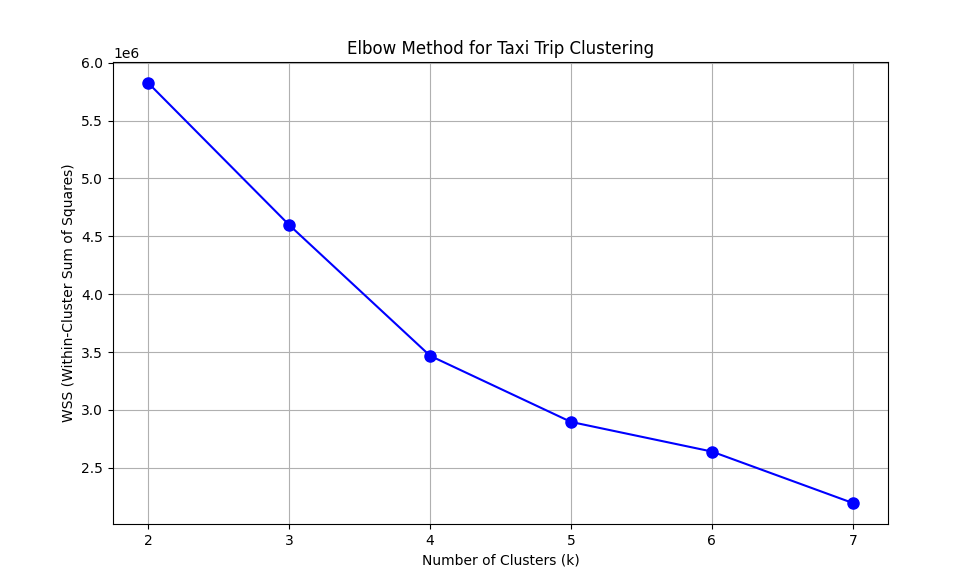

# NYC Taxi Trip Behavior Clustering Analysis

## 📌 Project Overview

This project aims to identify urban travel behavior patterns using clustering methods based on NYC yellow taxi trip data. By combining feature engineering and unsupervised learning, the project explores how multi-dimensional factors jointly shape travel behaviors.

---

## 🚀 Highlights

* Designed **feature engineering** based on temporal, spatial, and cost structures
* Transformed raw business data into **interpretable behavioral features**
* Applied and compared **K-Means and DBSCAN** clustering methods
* Evaluated clustering performance using **Elbow Method and Silhouette Score**
* Identified **interpretable travel behavior patterns** from large-scale trip data
* Built end-to-end pipeline from data preprocessing to model analysis

---

## 🧠 Methodology

### 1. Feature Engineering

To enhance interpretability, raw variables were transformed into behavior-aware features:

* **is_peak**: captures peak-hour travel demand
* **pu_freq**: represents spatial activity intensity
* **extra_ratio**: reflects cost structure characteristics

### 2. Clustering Methods

* **K-Means**: baseline model for global structure partitioning
* **DBSCAN**: density-based method for identifying irregular patterns and noise

### 3. Evaluation

* Elbow Method (WSS)
* Silhouette Score

---

## 📊 Results

The clustering results reveal distinct travel behavior patterns, including:

* High-frequency short-distance trips
* Medium-range regular trips
* Low-frequency but high-cost long-distance trips

📌 Example:


---

## 📂 Project Structure

```bash
NYC-Taxi-Trip-Behavior-Clustering-Analysis/
├── src/                                        # Core code
├── notebooks/                                  # Analysis notebook
├── results/                                    # Figures and outputs
├── 20230301_Yellow_Taxi_Trip_Data.csv          # Sample dataset
├── docs/                                       # Full report
├── README.md
└── requirements.txt
```

---

## ⚙️ How to Run

```bash
pip install -r requirements.txt
python src/kmeans_model.py
python src/dbscan_model.py
```

---

## 📄 Additional Notes

* Original implementation was conducted in a **distributed environment (Hadoop + Spark)**
* This repository provides a simplified version for reproducibility

---

## 📎 Full Report

Detailed analysis and experimental results can be found in:

```bash
docs/report.pdf
```

---

## 👤 Author

* Software Engineering Undergraduate
* Focus: Data Science / Machine Learning

---
